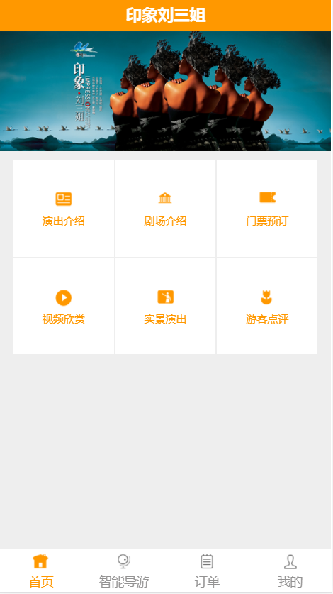

##
考试要求

***
###
考试时间：2017-09-07 14:10--17:30

> 上交命名为"姓名-日期-EXAM"  (英文半角短线连接符号)
> eg：申宏春-2017-09-07-EXAM.rar
####效果图

***
#*attention:*
> + ###需要使用`bootstrap`框架做到响应式布局，兼容所有设备；

> + ###所需图标样式名可查阅`./img/icons_class.png`

> + ###设计图所给尺寸为iphone6屏幕大小，用sizeMark具体测量，颜色用ps测，需精准；

> + ###不能使用表格布局，不能使用类表格布局如：dl dt dd；

> + ###所有css/js需用外链，css用sass编写；

> + ###编写编译`sass`文件的配置文件

> + ###轮播容器 `

` 没有左右切换，但是需要有轮播导航(橘色小圆点)

> + ###图标使用bootstrap图标库

##
预祝各位取得好成绩

